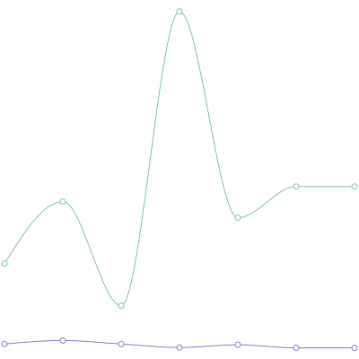
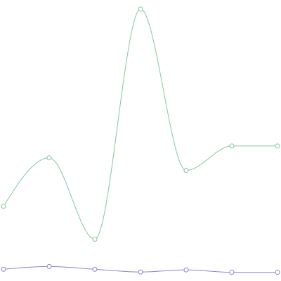

nextjs-image-generation is a POC on how to do server-side image generation.

## Getting Started

First, run the development server:

```bash
git clone https://github.com/yammerjp/nextjs-image-generation.git
cd nextjs-image-generation
npm install
npm run dev
```

Show the page `http://localhost:3000`, or download image.

```bash
curl localhost:3000/api/recharts-to-image.svg --output recharts-to-image.svg
curl localhost:3000/api/recharts-to-image.png --output recharts-to-image.png
```

Open recharts-to-image.png, to confirm server-side image generation.

## Overview

This repository converts Recharts generated graphs to PNG images in the following way.

1. Recharts (React components) => HTML String (by `ReactDOMServer.renderString()`)
2. HTML String => SVG (Extract SVG tags from the HTML)
3. SVG => PNG (by node-canvas) (The blog post I was referring to is: https://ji23-dev.com/blogs/nextjs-ogp)
)

## Sample Image

There are generated on server-side.

### PNG


### SVG



