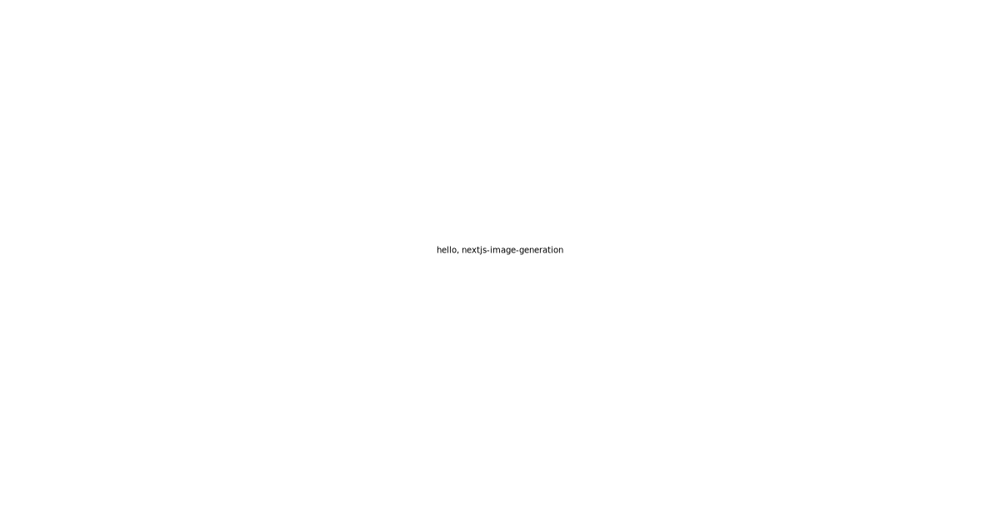

nextjs-image-generation is a POC on how to do server-side image generation.

This article has been implemented based on the following blog post.

https://ji23-dev.com/blogs/nextjs-ogp

## Getting Started

First, run the development server:

```bash
git clone https://github.com/yammerjp/nextjs-image-generation.git
cd nextjs-image-generation
npm install
npm run dev
```

Next, download image

```bash
curl localhost:3000/api/image --output download.png
```

Open download.png, to confirm server-side image generation.

## Sample Image

This is the image with server-side image generation.




